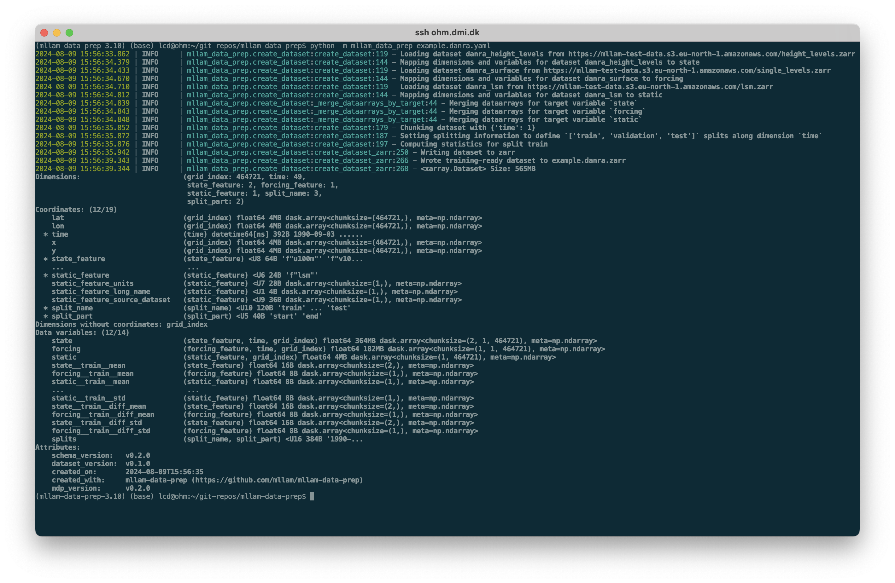

# mllam-data-prep

This package aims to be a *declarative* way to prepare training-data for data-driven (i.e. machine learning) weather forecasting models.
A training dataset is constructed by declaring in a yaml configuration file (for example [example.danra.yaml](example.danra.yaml)) the data sources, the variables to extract, the transformations to apply to the data, and the target variable(s) of the model architecture to map the data to.


The configuration is principally a means to represent how the dimensions of a given variable in a source dataset should be mapped to the dimensions and input variables of the model architecture to be trained.

The full configuration file specification is given in [mllam_data_prep/config/spec.py](mllam_data_prep/config/spec.py).


## Installation

To simply use `mllam-data-prep` you can install the most recent tagged version from pypi with pip:

```bash
python -m pip install mllam-data-prep
```

## Developing `mllam-data-prep`

To work on developing `mllam-data-prep` it easiest to install and manage the dependencies with [pdm](https://pdm.fming.dev/). To get started clone your fork of [the main repo](https://github.com/mllam/mllam-data-prep) locally:

```bash
git clone https://github.com/<your-github-username>/mllam-data-prep
cd mllam-data-prep
```

Use pdm to create and use a virtualenv:

```bash
pdm venv create
pdm use --venv in-project
pdm install
```

All the linting is handelled by `pre-commit` which can be setup to automatically be run on each `git commit` by installing the git commit hook:

```bash
pdm run pre-commit install
```

The branch, commit, push and make a pull-request :)


## Usage

The package is designed to be used as a command-line tool. The main command is `mllam-data-prep` which takes a configuration file as input and outputs a training dataset in the form of a `.zarr` dataset named from the config file (e.g. `example.danra.yaml` produces `example.danra.zarr`).

```bash
python -m mllam_data_prep example.danra.yaml
```

Example output:


